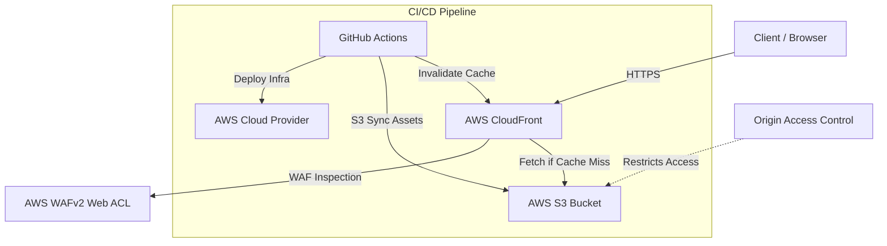

# Enterprise Static Asset Delivery Platform

A production-grade, highly secure, and optimized Content Delivery Network (CDN) platform on AWS using Terraform and GitHub Actions. This project deploys an Amazon S3 origin, an AWS CloudFront distribution secured via Origin Access Control (OAC), an AWS WAFv2 Web ACL for web protection, custom security headers, and an automated CI/CD pipeline for asset sync and cache invalidation.

---

## 🏗️ Architecture



### Key Security & Optimization Highlights
* **S3 Block Public Access & OAC**: The static assets S3 bucket is completely private. Direct public access is blocked. Access is permitted *only* to the CloudFront distribution via Origin Access Control (OAC) with AWS Signature Version 4.
* **AWS WAFv2 Protection**: The distribution is shielded by a Web ACL that includes the **AWS Common Rule Set** (OWASP Top 10 mitigation), the **Amazon IP Reputation List** (blocking bad actors/bots), and a **Custom IP Rate Limiting Rule** (defaulting to 500 requests per IP per 5 minutes).
* **Enterprise Caching Behaviors**: Optimized cache configurations partition files by type:
  * `/images/*`, `/css/*`, and `/js/*` utilize aggressive long-lived caches (`max-age=31536000, public, immutable`) and gzip/brotli compression.
  * `/docs/*` handles documents like PDFs securely without frame-ancestors.
* **Security Headers**: Standard response headers are appended to all requests:
  * `Strict-Transport-Security` (HSTS)
  * `Content-Security-Policy` (CSP)
  * `X-Frame-Options: DENY` (Anti-Clickjacking)
  * `X-Content-Type-Options: nosniff` (MIME Sniffing Block)
  * `Referrer-Policy: strict-origin-when-cross-origin`

---

## 📁 Repository Structure

```text
project 4/
├── .github/
│   └── workflows/
│       └── deploy.yml       # GitHub Actions CI/CD pipeline
├── src/                    # Static assets source code
│   ├── css/
│   │   └── style.css
│   ├── js/
│   │   └── app.js
│   ├── docs/
│   │   └── sample.txt
│   └── index.html          # Entry demonstration page
├── terraform/              # Infrastructure-as-Code files
│   ├── main.tf
│   ├── variables.tf
│   ├── s3.tf               # Private storage & CORS configs
│   ├── cloudfront.tf       # CDN endpoints, custom cache rules, security headers
│   ├── waf.tf              # Web Application Firewall & rate limits
│   ├── route53.tf          # CNAME DNS validation & SSL certs (optional)
│   ├── outputs.tf          # Endpoint outputs
│   └── terraform.tfvars    # Environment configuration overrides (ignored by git)
└── README.md               # Documentation
```

---

## 🚀 Getting Started

### 📋 Prerequisites
1. [AWS CLI](https://aws.amazon.com/cli/) installed and configured with appropriate administrative permissions.
2. [Terraform CLI](https://developer.hashicorp.com/terraform/downloads) (v1.3.0 or later) installed locally.
3. A custom domain (optional) managed in a AWS Route 53 Hosted Zone.

### 🛠️ Step 1: Run Terraform Locally

1. Change directory to `terraform`:
   ```bash
   cd terraform
   ```
2. Initialize Terraform and download provider plugins:
   ```bash
   terraform init
   ```
3. *(Optional)* If using a custom domain, create a `terraform.tfvars` file and specify parameters:
   ```hcl
   domain_name     = "assets.yourdomain.com"
   route53_zone_id = "Z0123456789ABCDEF1234"
   ```
4. Verify the resources to be created:
   ```bash
   terraform plan
   ```
5. Apply the configuration to deploy the infrastructure:
   ```bash
   terraform apply
   ```
6. Take note of the Outputs printed after completion:
   - `s3_bucket_name`: The bucket name generated for static files.
   - `cloudfront_domain_name`: The URL generated for the CDN distribution.

---

### 📦 Step 2: Upload Files and Test

1. Sync local static assets to the deployed S3 bucket:
   ```bash
   aws s3 sync ../src/ s3://<your-s3-bucket-name>/ --delete
   ```
2. Set optimal cache headers for asset types:
   ```bash
   # Cache CSS/JS aggressively
   aws s3 cp ../src/css/ s3://<your-s3-bucket-name>/css/ --recursive --metadata-directive REPLACE --cache-control "max-age=31536000, public, immutable"
   aws s3 cp ../src/js/ s3://<your-s3-bucket-name>/js/ --recursive --metadata-directive REPLACE --cache-control "max-age=31536000, public, immutable"
   ```
3. Open your browser and navigate to the `cloudfront_domain_name` (e.g., `https://d123456abcdef.cloudfront.net`). You should see the static index page loaded.
4. Verify direct S3 access is blocked:
   ```bash
   # Try downloading a file directly from S3
   curl -I https://<your-s3-bucket-name>.s3.amazonaws.com/index.html
   # Should return: HTTP/1.1 403 Forbidden
   ```
5. Verify security headers are present in the CDN response:
   ```bash
   curl -I https://<your-cloudfront-domain-name>/css/style.css
   # Look for headers like:
   # strict-transport-security: max-age=31536000; includeSubDomains; preload
   # content-security-policy: default-src 'self'...
   ```

---

## 🤖 CI/CD with GitHub Actions

The provided workflow [deploy.yml](file:///.github/workflows/deploy.yml) automates tests, infrastructure deploys, file syncs, and cache invalidation.

### Setting Up GitHub Secrets
To run the deployment pipeline in GitHub, configure the following secrets/variables in your GitHub Repository under **Settings > Secrets and variables > Actions**:

* **AWS Authentication (OIDC - Recommended)**:
  Configure OIDC federation between GitHub and AWS, then supply the role ARN in `role-to-assume` inside [deploy.yml](file:///.github/workflows/deploy.yml).
* **AWS Authentication (Access Keys - Alternative)**:
  If using Access Keys, add the following secrets:
  - `AWS_ACCESS_KEY_ID`
  - `AWS_SECRET_ACCESS_KEY`

---

## 🧹 Clean Up

To destroy the deployed resources and avoid ongoing AWS charges:
```bash
terraform destroy
```
*(Note: The S3 bucket is configured with `force_destroy = true`, so it will automatically clean up all objects during destruction.)*
