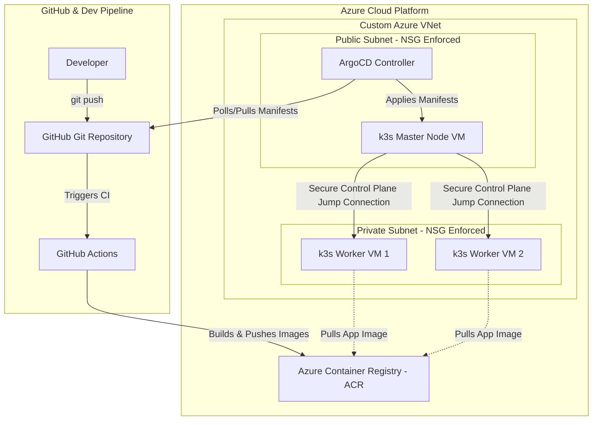

# Project 6: Architecture Analysis

This project contains a detailed analysis of the following DevOps architecture:
> **Deploying Kubernetes manually is good. Automating the entire cloud footprint from zero to GitOps is game-changing. 🚀**
> 
> *An end-to-end production setup on Azure using Terraform, GitHub Actions, k3s, and ArgoCD.*

---

## 1. Architectural Diagram

Below is a visual representation of the architecture described in the text:

---

## 2. Component Analysis

### A. Infrastructure as Code (IaC): Terraform
* **Implementation:** Defines a custom Azure VNet segmented into Public and Private subnets. Security is enforced via Network Security Groups (NSGs) under zero-trust principles.
* **Analysis:** 
  * **Pros:** Terraform provides declarative, repeatable environments. VNet isolation ensures private databases or sensitive application workloads in the private subnet are completely shielded from direct public ingress.
  * **Considerations:** To ensure zero-trust, the NSGs should restrict ingress to only the minimum necessary ports (e.g., HTTPS for the Master/ArgoCD and SSH only from trusted bastion/IP ranges). State files must be stored securely (e.g., Azure Blob Storage with encryption and state locking via Table Storage).

### B. Multi-Node k3s Cluster
* **Implementation:** 3 VMs (1 Master in Public subnet, 2 Workers in Private subnet). Workers communicate with the control plane via a Master jump/tunnel connection.
* **Analysis:**
  * **Pros:** k3s is an exceptionally lightweight Kubernetes distribution (less than 100MB binary), making it highly cost-effective for VM deployments compared to standard heavy upstream Kubernetes (kubeadm) or managed AKS.
  * **Considerations:** 
    * **Single Point of Failure (SPOF):** A single master node means the control plane is not high-availability (HA). If the master VM fails, cluster orchestration stops. For production workloads, k3s should be run in HA mode using a multi-agent control plane with an external datastore (like Azure SQL/PostgreSQL) or embedded etcd.
    * **Networking Tunnel:** k3s supports agent connection proxying. The worker nodes initiate outbound connections to the master node's secure API port, ensuring that no inbound public ports need to be opened on the worker nodes.

### C. Automated CI/CD Pipeline: GitHub Actions & ACR
* **Implementation:** Code push triggers GitHub Actions, which builds container images and pushes them to Azure Container Registry (ACR).
* **Analysis:**
  * **Pros:** SaaS-based CI reduces maintenance overhead. ACR is a secure, private registry native to Azure that integrates cleanly with Azure Active Directory (AAD) / Managed Identities.
  * **Considerations:** Rather than using long-lived Azure Service Principal secrets in GitHub Repository Secrets, the pipeline should use **OIDC (OpenID Connect)** authentication with Azure, allowing GitHub Actions to authenticate passwordlessly and securely.

### D. Declarative GitOps: ArgoCD
* **Implementation:** ArgoCD installed on the master node, syncing cluster state to the Git repository.
* **Analysis:**
  * **Pros:** The pull-based model of ArgoCD avoids exposing the cluster API to the external internet or CI pipelines. The cluster pulls configuration rather than GitHub Actions pushing it.
  * **Considerations:** Running ArgoCD on the single master node shares resources with the control plane. In a large production cluster, GitOps controllers should run in a dedicated system namespace with strict resource limits, or even a separate management cluster.
  * **Manifest Management:** To maximize dry run capabilities and environment customization (Dev, Staging, Prod), tools like Kustomize or Helm charts should be used in the Git repository.

---

## 3. Recommended DevOps Enhancements

To move this setup from a "cool prototype" to a resilient, enterprise-grade production environment, we recommend:

1. **Enable High Availability (HA) for k3s:**
   * Transition to a 3-master (control plane) node topology utilizing embedded etcd or a managed database (like Azure Database for PostgreSQL).
2. **Implement Secret Management:**
   * Avoid putting raw secrets (DB passwords, API keys) in the Git repository. Use tools like **SOPS**, **Sealed Secrets**, or integrate **External Secrets Operator (ESO)** with **Azure Key Vault**.
3. **Passwordless Auth (OIDC & Managed Identities):**
   * Configure GitHub Actions to authenticate to Azure via OIDC federated credentials.
   * Enable Azure Managed Identities on the k3s worker VMs to authenticate to ACR natively without hardcoded credentials.
4. **Observability Stack:**
   * Deploy Prometheus and Grafana for resource monitoring, and a lightweight logging agent (like Loki or Fluentbit) to capture container logs.

---

## 4. Preferred GitOps Tool Pairings (Public Cloud Comparison)

| Stack Component | Standard/Simple | Enterprise Native (Azure) | Multi-Cloud/CNCF Native |
| :--- | :--- | :--- | :--- |
| **IaC** | Terraform | Azure Bicep | Pulumi (TypeScript/Python) |
| **Orchestration** | k3s VMs | Azure Kubernetes Service (AKS) | EKS / GKE / AKS |
| **CI** | GitHub Actions | Azure Pipelines | GitLab CI |
| **GitOps** | ArgoCD | Azure GitOps (Flux v2 extension) | Flux v2 or ArgoCD |
| **Secrets** | SOPS / Sealed Secrets | Azure Key Vault + ESO | HashiCorp Vault |
